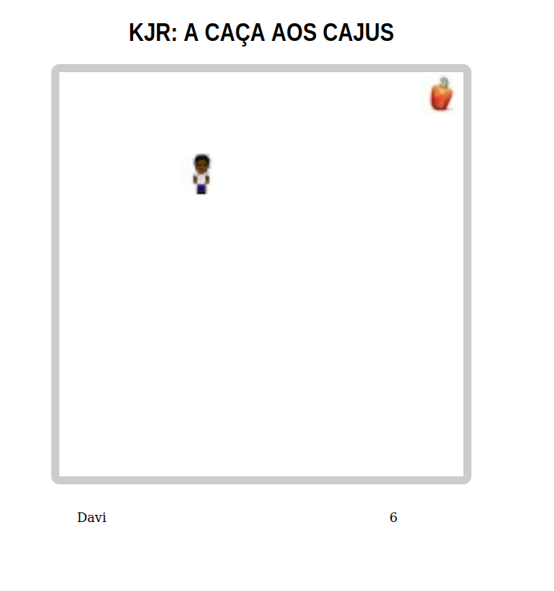
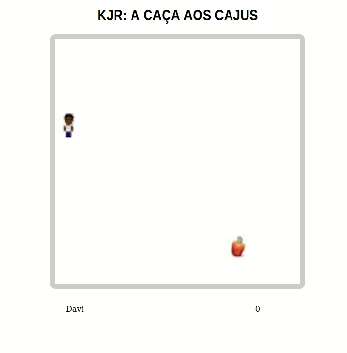

# KJR: A CAÇA AOS CAJUS

Este jogo foi desenvolvido com o intuito de estudar um pouco sobre desenvolvimento de jogos e padrões de projetos.

Talvez você encontre alguns bugs e alguns códigos mal otimizados pois ele foi desenvolvido em um final de semana...

Todavia, se divirta clicando [aqui](http://j-o.herokuapp.com/) e jogando,

ou fique a vontade para baixar o repositório e fazer suas próprias alterações!

`## Como rodar o projeto:`

Primeiro, instale as dependências executando `yarn`;

Configure o `.env` seguindo o `.env-example`;

Por fim é só rodar o jogo executando `yarn dev` para executar o modo de desenvolvimento com o nodemon,

ou `yarn start` para rodar com o node.

